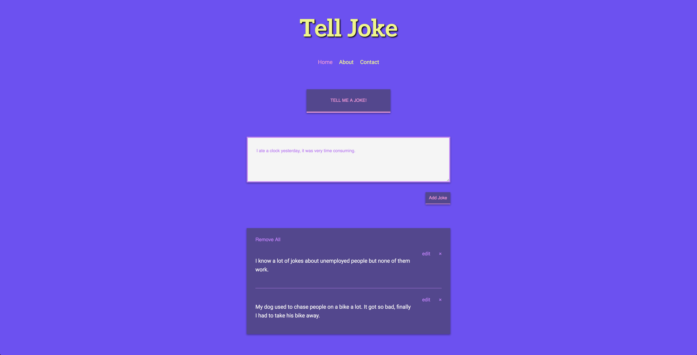

# **Telljoke**

This project is based on **React**, **Flexbox** layout, **HTML5** and modern **CSS3** principes. You can modify and use this project or certain components if you wish.

Last successfully tested on node version **8.2.1**

<br>



<br>

## Installation

Use these commands to install the dependencies and start the server.

1. **Clone from Github**

   ```
   $ git clone git@github.com:devmaroy/telljoke_cu_pe_re_en.git
   ```

2. **Install dependencies**
   ```
   $ yarn install / npm install
   ```
3. **Navigate into your directory where you cloned repository**

   ```
   $ cd my-folder
   ```

4. **Start it up**

   ```
   Development:
   $ npm run build:dev / yarn run build:dev

   Production:
   $ npm run build:prod / yarn run build:prod
   ```

**Your site is now running at `http://localhost:9999`!**

<br>

## Structure

A quick look at the top-level files and directories you'll see in my project.

    .
    ├── public
    ├── server
    ├── src
    ├── .babelrc
    ├── .gitignore
    ├── package.json
    ├── postcss.config.js
    ├── screenshot.png
    ├── webpack.config.js
    ├── yarn.lock
    └── readme.md

<br>

1.  **`/public`**: Here you can find public files and favicon files.

2.  **`/server`**: Very simple express server.

3.  **`/src`**: This directory contains all the necessary files such as React components and styles.

4.  **`.babelrc`**: Configuration file for babel.

5.  **`.gitignore`**: This file tells git which files it should not track / not maintain a version history for.

6.  **`package.json`**: A manifest file for Node.js projects, which includes things like metadata (the project’s name, author, etc). This manifest is how npm knows which packages to install for project.

7. **`postcss.config.js`**: Configuration file for PostCSS

8.  **`screenshot.png`**: Screenshots of the final website.

9.  **`webpack.config.js`**: Configuration file for webpack

10. **`yarn.lock`**: There is an identifier for every dependency and sub dependency that is used for a project.

11. **`readme.md`**: A text file containing useful reference information about project.

<br>

<hr>

<br>

### Live example:

**[telljoke.marekmatejovic.com](https://telljoke.marekmatejovic.com)**

<br>

Created by **[@devmaroy](https://twitter.com/devmaroy)** feel free to contact me

e-mail: **[hello@devmaroy.com](mailto:hello@devmaroy.com?subject=[GitHub]%20telljoke_cu_pe_re_en)**
